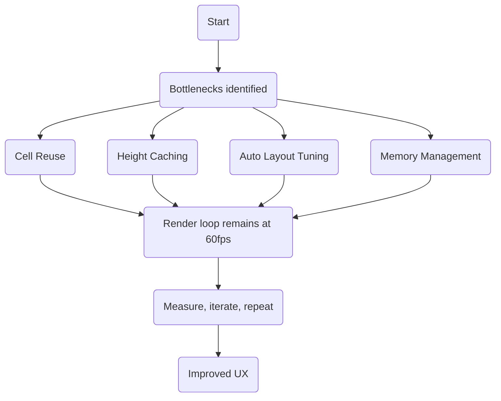

| Difficulty | Channel | Tags |
|---|---|---|
| advanced | ios | autolayout, tableview, collectionview |

Picture this: Pinterest’s iOS feed pulsing with hundreds of pins, yet the moment content appears, every frame feels snappy and alive instead of sluggish. That real-world struggle—startup delays around 1.12 seconds and image-rendering lags reaching ~230ms per visible pin—became a rallying cry for performance discipline 1. The lesson: focus on what users actually see, measure with trace-based diagnostics, and shrink the blockers that steal the first impression of fluidity 1.

---

## Hooked by a rough start

Many developers assume performance gains come from shaving milliseconds off every operation. In the Pinterest case, the stakes were higher: a visually rich feed hid two costly bottlenecks at startup and during scrolling. Startups and designers alike learned that the first visible content and the smoothness of the initial paint mattered more than micro-optimizations on off-screen assets. The hard truth: if content isn’t ready to show, the whole experience suffers, no matter how clever the rest of the code looks 1 . 🧭💡 The first seconds set expectations; the audience notices when content stutters or lags. Tracing reveals where to invest effort, not where the theory says to optimize. The goal is 60fps perception, not a perfect waterfall of micro-optimizations.

## Discovery: the hero’s toolkit

The journey begins by assembling a toolkit that directly addresses the user-visible work of a table-like feed: memory, layout work, and render-time optimizations. The core ideas map cleanly to a battle-tested playbook: Cell reuse to curb churn and memory pressure. This is the backbone of smooth scrolling in long lists. (Code pattern shown below.) 2 Height caching to avoid repeated layout calculations during fast scrolls. By remembering heights, the system avoids recalculating everything for off-screen rows. 3 4 Auto Layout optimization paired with selective manual layout when necessary. This reduces the constraint solving work during scrolling. 5 6 Memory management with careful closure handling and cleanup when cells go offscreen. 7 These ideas aren’t theory; they’re proven tactics that teams rely on when the feed must feel instantaneous to users.

## The Twist: counterintuitive wins

Two counterintuitive insights often surface: Precomputing heights isn’t always about every cell; it’s about the ones that appear on screen first. If the on-screen cells render quickly, users perceive performance as faster, even if off-screen cells are still heavy. Trace-driven decisions beat blanket optimizations 1 13 . Auto Layout isn’t inherently slow if constrained to minimal, well-ordered relations and if intrinsicContentSize is leveraged where possible. In practice, many teams reduce constraint complexity and rely on systemLayoutSizeFitting efficiently for height estimation 4 6 . Here’s where real-world libraries come into play: several lightweight caches and helpers demonstrate the model—height caches, estimated heights, and template-based sizing that avoids excessive layout passes 2 3 4 5 . The moral: optimize the path that the user actually traverses, not every path the code can take 13 .

## Implementation Playbook

A practical blueprint for bringing these ideas into an app, with representative snippets that mirror common patterns: Cell reuse lifecycle: reset high-cost content in prepareForReuse to avoid stale data during rapid reuse. This is a staple in smooth scrolling implementations. 2 Height caching pattern: check cache first, compute if missing, then store for future reuse. This approach dramatically reduces repeated, expensive height calculations during fast scrolling. 3 Auto Layout optimization notes: prefer setNeedsLayout over layoutIfNeeded, lean on intrinsicContentSize where viable, and use systemLayoutSizeFitting for height estimation. 6 Code excerpts (illustrative; adapt to your project): override func prepareForReuse() { super.prepareForReuse() // Reset expensive operations imageView.image = nil complexView.resetContent() } private var heightCache: [IndexPath: CGFloat] = [:] func tableView(_ tableView: UITableView, heightForRowAt indexPath: IndexPath) -> CGFloat { if let cached = heightCache[indexPath] { return cached } let height = calculateHeight(for: indexPath) heightCache[indexPath] = height return height } Auto Layout tips: use setNeedsLayout() instead of layoutIfNeeded(), lean on intrinsicContentSize where possible, and compute heights with systemLayoutSizeFitting when necessary. 5 6 1

## A battle-tested Crew: memory and rendering

Memory management keeps the ship from sinking during long feeds. Key practices include: Use weak references for cell closures to break potential strong reference cycles. 7 Clean up in didEndDisplaying to reclaim resources promptly as cells scroll offscreen. 7 Consider asynchronous image loading with placeholders to avoid blocking the main thread during rapid scrolls. 7 These guardrails empower the UI to stay responsive under memory pressure and keep scrolling feeling fluid.

## Proof in the pudding: Pinterest’s lessons

Pinterest’s production story underscored a broader truth: non-critical work can derail the user experience if it competes for GPU/CPU time during critical moments. The takeaway: content on screen drives perception, so tracing and prioritizing that content unlocks tangible speedups in 60fps scrolling 1 . The broader pattern shows that cassette-like optimizations—while useful—should be guided by concrete measurements rather than assumptions 13 14 .

## Putting it all together: a visual map

Mermaid diagram below tells the story of turning bottlenecks into a clean, maintainable flow. It highlights decision points from bottleneck discovery to 60fps rendering, ending with iterative improvements. Real-World Case Study Pinterest Pinterest’s iOS feed was visually rich and loaded with hundreds of pins. Analysis revealed two production bottlenecks: startup animation delays (~1.12s before content appeared) and scroll-time image rendering delays (up to ~230ms per visible pin), harming perceived performance during 60fps scrolling. Key Takeaway: Prioritize content that users see first and shrink startup delays; use trace-based diagnostics to guide where to optimize—don’t optimize around non-critical animations or off-screen assets unless they measurably impact on-screen performance.

## Wrapping Up

Tomorrow’s performance wins come from a disciplined sequence: measure what users notice first, cache and reuse aggressively, and keep Auto Layout constraints lean. The most memorable speedups aren’t in removing content—it's in delivering it faster where it matters most.

> **Did you know?**
> The same feed optimization mindset helped Netflix and other streaming apps reduce startup latency by focusing on what users actually see first, not what’s happening behind the scenes.

---

## Architecture & Flow

<strong>Original Interview Question</strong>

**Q:** How would you optimize a UITableView with 10,000+ complex cells using Auto Layout while maintaining 60fps scrolling and memory efficiency?

**A:** Use cell reuse, pre-calculate heights, implement heightForRowAt caching, and optimize Auto Layout constraints with manual layout when needed.

## Conclusion

Tomorrow’s performance wins come from a disciplined sequence: measure what users notice first, cache and reuse aggressively, and keep Auto Layout constraints lean. The most memorable speedups aren’t in removing content—it's in delivering it faster where it matters most.

---

## References

1. [Unlocking a 1.35s Performance Boost in Pinterest’s Rich Content Loading on iOS](https://www.productscience.ai/case-studies/pinterest-ios) — article
2. [IGTableViewEstimatedHeightCache](https://github.com/indiegogo/IGTableViewEstimatedHeightCache) — repository
3. [TLCachedAutoHeightCell](https://github.com/ToccaLeee/TLCachedAutoHeightCell) — repository
4. [UITableView-CellHeightCalculation](https://github.com/Tinghui/UITableView-CellHeightCalculation) — repository
5. [UITableView-FDTemplateLayoutCell](https://github.com/forkingdog/UITableView-FDTemplateLayoutCell) — repository
6. [UITableView-MDKAutoLayoutHeight](https://github.com/miku1958/UITableView-MDKAutoLayoutHeight) — repository
7. [Tricks for improving iPhone UITableView scrolling performance](https://gist.github.com/choiceforyou/8749176) — gist
8. [Texture - AsyncDisplayKit](https://github.com/TextureGroup/Texture) — repository
9. [iOS Progress Bar (Progress View)](https://digitalocean.com/community/tutorials/ios-progress-bar-progress-view) — tutorial
10. [Web performance - Wikipedia](https://en.wikipedia.org/wiki/Web_performance) — encyclopedia
11. [iOS SDK - Wikipedia](https://en.wikipedia.org/wiki/iOS_SDK) — encyclopedia
12. [UIKit - Wikipedia](https://en.wikipedia.org/wiki/UIKit) — encyclopedia
13. [GUIWatcher: Automatically Detecting GUI Lags by Analyzing Mobile Application Screencasts](https://arxiv.org/html/2502.04202v1) — arxiv
14. [Screencast-Based Analysis of User-Perceived GUI Responsiveness](https://arxiv.org/html/2508.01337v1) — arxiv
15. [ScrollTest: Evaluating Scrolling Speed and Accuracy](https://arxiv.org/abs/2210.00735) — arxiv

---

**Author:** Satishkumar Dhule — [GitHub](https://github.com/satishkumar-dhule) · [LinkedIn](https://linkedin.com/in/satishkumar-dhule) · [Website](https://satishkumar-dhule.github.io)
