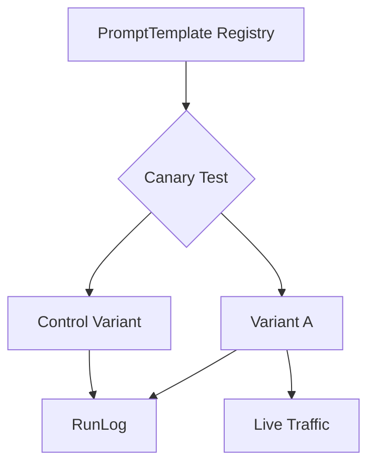

| Difficulty | Channel | Tags |
|---|---|---|
| advanced | prompt-engineering | prompt-engineering |

It was 3am when the pager lit up with a safety-first deployment in Uber's Michelangelo ML platform, a reminder that rapid experimentation only thrives when guards are baked in 1. That story shows how automated safeguards and continuous validation can accelerate velocity without inviting risk. Now, imagine applying that mindset to a real-time analytics assistant used by Tesla, Robinhood, and Adobe: a prompt experiment manager that canary-tests new variants, measures latency and safety, and automatically routes the best variant for each prompt. This piece traces that journey from data models to a minimal Python prototype, and finally a practical blueprint for teams chasing both speed and safety.

---

## From Guardrails to Velocity

Problem at hand. Real-time analytics prompts must balance latency, data sensitivity, and safety. Teams publish multiple prompt variants with metadata; the system canary-tests these variants against a control on live traffic, and then selects a variant per prompt to meet latency targets while respecting data sensitivity. This is not just about speed; it’s about trust. In Uber’s experience, embedding safety as a default enables rapid experimentation and faster mitigation when issues arise 1 . What’s at stake. A misrouted prompt could incur high latency, expose sensitive data, or trigger unsafe outputs. The goal is to design a data model and routing policy that makes safer, faster decisions automatically, while preserving provenance for reproducibility 2 3 .

## Data Model: The Registry that Keeps Score

Build a PromptTemplate registry with fields: template_id: unique identifier for the prompt family version: semantic versioning for changes variants: list of variant objects, each with latency, data_sensitivity, and guardrails applied guardrails: per-variant safety constraints RunLog: provenance data for every run (who, when, what variant, outcomes) This structure supports canary testing, easier rollbacks, and reproducible experiments across teams. The registry enables deterministic routing decisions by providing a holistic view of each variant’s performance and safety posture.

## Routing Policy: Latency Budgets Meet Data Sensitivity

The routing policy translates a per-prompt latency_budget and data_sensitivity into a variant choice. A simple yet effective rule set can look like: Filter variants with latency Among those, prefer variants with lower data_sensitivity (safer options) If none meet latency_budget, fall back to the fastest variant while logging a latency exception for observability Always append the RunLog entry for provenance This approach creates a predictable, auditable flow from user request to chosen variant, while keeping a strong safety signal baked into the path.

## A Minimal Prototype: Deterministic Variant Selection

Building a tiny, deterministic prototype helps teams see the pattern without getting bogged down in infrastructure. The following snippet returns the chosen variant and appends a provenance entry in RunLog. Real-World Case Study Uber Uber's Michelangelo ML platform scaled to production with a safety-first deployment approach. In 2025 they rolled out automated safeguards that catch issues early, validate models reliably, and enable safe, gradual rollouts across thousands of online use cases. Key Takeaway: Embedding safety as default in the deployment platform enables rapid, safer experimentation and faster mitigation when issues arise, showing that automated guards and continuous validation dramatically reduce risk without slowing velocity.

## Wrapping Up

The journey from guardrails to velocity shows that safe experimentation scales. By embracing a PromptTemplate registry, clear routing policies, and a minimal but expressive prototype, teams can unlock faster innovation without sacrificing safety. The question to carry forward: how will your teams bake guardrails into every deployment so experimentation never sleeps?

> **Did you know?**
> Some teams discover that a slightly slower variant with stronger safety constraints can reduce downstream remediation costs by orders of magnitude.

---

## Architecture & Flow

<strong>Original Interview Question</strong>

**Q:** Design a 'prompt experiment manager' for a real-time analytics assistant used by Tesla, Robinhood, and Adobe. Teams publish prompt variants with metadata; the system can canary-test new variants against a control on live traffic, measure latency and safety, and automatically pick a variant per prompt based on latency targets and data sensitivity. Provide a data model, routing policy, and a minimal Python prototype returning the chosen variant and run provenance?

**A:** Proposed answer: Build a PromptTemplate registry with fields template_id, version, variants, guardrails, and a RunLog. Routing uses a policy that maps latency_budget and data_sensitivity to a chosen v

## Conclusion

The journey from guardrails to velocity shows that safe experimentation scales. By embracing a PromptTemplate registry, clear routing policies, and a minimal but expressive prototype, teams can unlock faster innovation without sacrificing safety. The question to carry forward: how will your teams bake guardrails into every deployment so experimentation never sleeps?

---

## References

1. [Raising the Bar on ML Model Deployment Safety](https://www.uber.com/blog/raising-the-bar-on-ml-model-deployment-safety/) — article
2. [A/B testing](https://en.wikipedia.org/wiki/A/B_testing) — documentation
3. [Latency](https://en.wikipedia.org/wiki/Latency) — documentation
4. [Safety engineering](https://en.wikipedia.org/wiki/Safety_engineering) — documentation
5. [Python 3 Documentation](https://docs.python.org/3/) — documentation
6. [AWS Documentation](https://docs.aws.amazon.com/) — documentation
7. [Kubernetes Documentation](https://kubernetes.io/docs/) — documentation
8. [DigitalOcean Community Tutorials](https://www.digitalocean.com/community/tutorials/) — documentation
9. [Requests: HTTP for Humans](https://github.com/psf/requests) — documentation
10. [PyTorch](https://github.com/pytorch/pytorch) — documentation
11. [Attention Is All You Need (arXiv)](https://arxiv.org/abs/1706.03762) — paper

---

**Author:** Satishkumar Dhule — [GitHub](https://github.com/satishkumar-dhule) · [LinkedIn](https://linkedin.com/in/satishkumar-dhule) · [Website](https://satishkumar-dhule.github.io)
