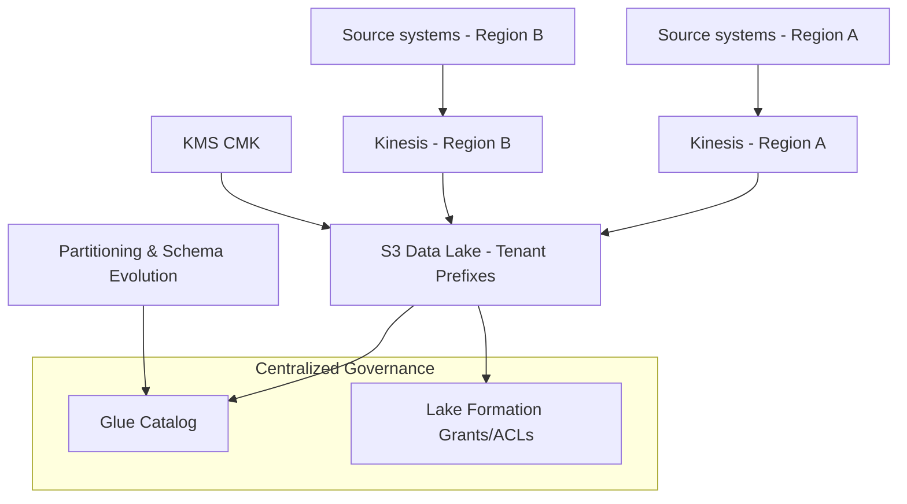

| Difficulty | Channel | Tags |
|---|---|---|
| intermediate | aws | aws |

Picture Vanguard wrestling with a multi-region CDC backbone that streams changes from remote sources into AWS Kinesis across regions, ensuring failover with minimal data loss. That real-world challenge became the compass for architects tackling cross-account, real-time pipelines 1. In this journey, readers will explore how to design for tenant isolation, least-privilege access, and automatic encryption management, all while keeping data flowing when failures loom.

---

## Building the Challenge: Why cross-region, multi-account pipelines matter

Many developers discover that real-time analytics demands more than fast streams; it requires disciplined data governance across accounts and regions. The stakes rise when failover must be seamless and data isolation non-negotiable. The Vanguard case demonstrates how explicit state, region-aware gating, and decoupled CDC processing prevent replication loops and data loss, turning a fragile setup into a resilient backbone 1 . Building on this, the architecture must support: multi-region ingestion, centralized governance, and clean separation of tenant data.

## Discovery: What the blocks look like in practice

Across teams, the pattern emerges: separate producers in each region feed dedicated Kinesis streams, while a centralized data lake in S3 stores tenant-scoped prefixes for isolation. Per-tenant IAM roles with cross-account AssumeRole enable secure delegation, and auto-rotating CMKs keep data at rest protected. Lake Formation grants/ACLs enforce isolation, while Glue catalogs handle schema evolution and partitioning. These elements—Kinesis, S3 lake, IAM roles, CMK rotation, Lake Formation, and Glue—form the spine of a practical, scalable pipeline that you can actually operate in production 2 3 4 5 6 7 8 9 .

## Implementation Pattern: How the pieces fit together

The design centers on a per-region data path feeding a centralized, tenant-scoped data lake. In each region, events land in a Kinesis Stream, then flow to a centralized S3 data lake with tenant prefixes. Data governance is enforced via Lake Formation grants and ACLs, while Glue maintains a centralized catalog with robust partitioning and schema evolution. Encryption at rest uses KMS CMKs with automatic rotation, and cross-account access is achieved through STS AssumeRole patterns. The blueprint balances isolation with controlled, auditable access, enabling secure analytics across regions while reducing blast radius. Real-World Case Study Vanguard Vanguard needed a resilient, multi-region data ingestion backbone for Change Data Capture (CDC) flowing from remote sources into AWS Kinesis Data Streams across regions, enabling failover with minimal data loss and seamless data availability for analytics. Key Takeaway: Cross-region ingestion benefits from explicit, centralized state with DynamoDB Global Tables, clear active-region gating to avoid replication loops, and decoupled CDC processing via region-specific producers and replication Lambdas. Plan for testing failover scenarios to validate data continuity and recovery.

## Wrapping Up

The journey circles back to the opening challenge: a resilient, secure, cross-region ingestion backbone that keeps data moving where it matters. Plan for failover tests, codify least-privilege patterns, and treat tenant isolation as a first-class design requirement, not an afterthought. The takeaway is clear: architecture that weathers outages today scales for tomorrow.

> **Did you know?**
> Many developers discover that multi-region CDC is as much about governance and failover discipline as it is about speed.

---

## Architecture & Flow

<strong>Original Interview Question</strong>

**Q:** How would you implement a cross-region, multi-account data ingestion pipeline for real-time analytics on AWS, ensuring tenant isolation, least-privilege IAM roles, cross-account access, and automatic CMK rotation, using Kinesis Streams, S3, Lake Formation, and Glue?

**A:** Design a cross-region, multi-account data ingestion pipeline using Kinesis Data Streams deployed in each region to collect real-time data, which feeds into a centralized S3 data lake organized with tenant-scoped prefixes for isolation. Implement per-tenant IAM roles following least-privilege principles with cross-account AssumeRole access patterns for secure delegation. Enable automatic CMK rotation through AWS KMS for encryption at rest, enforce strict data isolation via Lake Formation grants and ACLs, and utilize AWS Glue for centralized catalog management with proper partitioning and schema evolution support.

## Conclusion

The journey circles back to the opening challenge: a resilient, secure, cross-region ingestion backbone that keeps data moving where it matters. Plan for failover tests, codify least-privilege patterns, and treat tenant isolation as a first-class design requirement, not an afterthought. The takeaway is clear: architecture that weathers outages today scales for tomorrow.

---

## References

1. [How Vanguard made their technology platform resilient and efficient by building cross-Region replication for Amazon Kinesis Data Streams](https://aws.amazon.com/blogs/big-data/how-vanguard-made-their-technology-platform-resilient-and-efficient-by-building-cross-region-replication-for-amazon-kinesis-data-streams/) — article
2. [Amazon Kinesis Data Streams Getting Started](https://docs.aws.amazon.com/kinesis/latest/dev/introduction.html) — documentation
3. [Amazon Simple Storage Service (S3) Getting Started](https://docs.aws.amazon.com/AmazonS3/latest/userguide/Welcome.html) — documentation
4. [AWS Lake Formation Developer Guide](https://docs.aws.amazon.com/lake-formation/latest/dg/what-is-lake-formation.html) — documentation
5. [AWS Glue Overview](https://docs.aws.amazon.com/glue/latest/dg/what-is-glue.html) — documentation
6. [AWS Identity and Access Management (IAM) User Guide](https://docs.aws.amazon.com/IAM/latest/UserGuide/Welcome.html) — documentation
7. [AWS Key Management Service (KMS) Developer Guide](https://docs.aws.amazon.com/kms/index.html) — documentation
8. [AWS Security Token Service (STS) Developer Guide](https://docs.aws.amazon.com/STS/latest/APIReference/welcome.html) — documentation
9. [Amazon DynamoDB Global Tables](https://docs.aws.amazon.com/amazondynamodb/latest/developerguide/GlobalTables.html) — documentation
10. [Amazon Kinesis](https://en.wikipedia.org/wiki/Amazon_Kinesis) — documentation
11. [amazon-kinesis-data-generator (GitHub)](https://github.com/awslabs/amazon-kinesis-data-generator) — github
12. [Kubernetes Storage](https://kubernetes.io/docs/concepts/storage/) — documentation
13. [AWS Architecture Center](https://aws.amazon.com/architecture/) — documentation
14. [Vanguard cross-region replication for Kinesis (original article)](https://aws.amazon.com/blogs/big-data/how-vanguard-made-their-technology-platform-resilient-and-efficient-by-building-cross-region-replication-for-amazon-kinesis-data-streams/) — article

---

**Author:** Satishkumar Dhule — [GitHub](https://github.com/satishkumar-dhule) · [LinkedIn](https://linkedin.com/in/satishkumar-dhule) · [Website](https://satishkumar-dhule.github.io)
