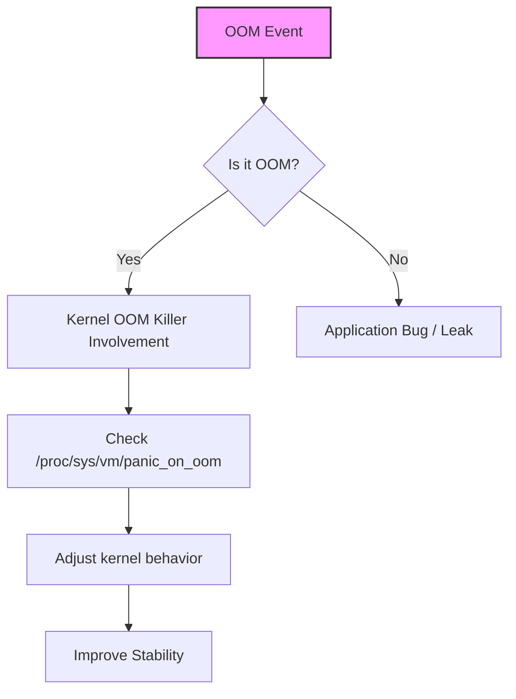

| Difficulty | Channel | Tags |
|---|---|---|
| intermediate | linux | linux |

Seqera Labs faced a brutal wake-up call in mid-2022: Nextflow tasks on AWS EC2 containers began dying with OOM errors even when memory appeared sufficient 1. The clock ticked, the pager screamed, and the team realized this wasn’t a simple flaky bug — it was a memory-management mystery where kernel behavior could rewrite the rules of production stability. The journey begins with a single question: is the killer truly Out Of Memory, or something more elusive hiding in the kernel’s memory ledger?

---

## The Case Opens

Picture this: a pipeline that used to hum along now splinters under pressure, tasks dying at the edge of memory cliffs. In this world, the stakes aren’t just latency spikes; they’re angry customers, delayed analyses, and a production floor that won’t tolerate unreliable workloads. The real-world Scenario from Seqera Labs shows that containers can crash not from obvious leaks alone, but from how the kernel manages memory under load 1 . Your goal is to peel back the curtain and determine whether the observed terminations are OOM kills or something subtler like kernel memory pressure, cgroup misconfigurations, or swap behavior. The detective work begins by assuming the memory ledger may lie: free memory doesn’t always equal usable memory when the kernel’s memory management is under stress 2 .

## The Clues Gathered

You’ll systematically collect evidence from logs, memory statistics, and per-process footprints. Start with these checks to separate OOM from other causes: Check kernel messages for OOM indicators: dmesg | grep -i oom and scan /var/log/messages for related warnings 3 . Observe overall memory usage: free -h to see total, used, and free memory; watch for sudden drops or high watermark patterns. Identify memory hogs: ps aux --sort=-%mem | head -10 surfaces processes consuming the most RAM. Inspect a culprit process’s footprint: cat /proc/<pid>/status and look for VmRSS to quantify resident memory usage. If an OOM event is suspected, examine kernel panic and oom behavior knobs: /proc/sys/vm/panic_on_oom and /proc/sys/vm/oom_kill_allocating_task reveal how the kernel decides which task to terminate 3 .

## The Twist: Kernel Memory Knows More

Many developers discover that a system can experience memory pressure even when free memory looks healthy. The kernel tracks various memory pools (slab, page cache, etc.) and may reclaim or kill tasks under pressure in ways that aren’t obvious from free alone. The crucial insight is that kernel-level memory pressure and container memory limits can interplay in surprising ways, especially under heavy I/O or multi-tenant workloads 2 . To understand kernel-driven outcomes, inspect kernel parameters that influence OOM behavior and panic responses: /proc/sys/vm/panic_on_oom and /proc/sys/vm/oom_kill_allocating_task help explain why the kernel chooses a particular victim when memory is exhausted 3 .

## The Fix: Reproduce, Tune, and Prevent

Armed with evidence, teams adopt a disciplined approach: Controlled reproduction: simulate memory pressure in a staging environment to observe OOM behavior without risking production. Tune container and host memory boundaries: set sensible memory limits and consider swap strategy so memory pressure doesn’t translate into abrupt terminations. Swap and swappiness: ensure swap is configured thoughtfully; improper swap can mask excitement on memory pressure or cause thrashing 7 8 . Kernel parameter tuning: adjust swappiness and related VM tunables to balance cache pressure against foreground workloads; document changes and monitor impact 3 7 . Establish alerts: memory utilization thresholds, swap activity, and OOM events should trigger automated runbooks for rapid investigation 7 .

## Real-World Proof: Battle-Tested Patterns

The fabric of modern reliability includes chaos-tested resilience and memory-aware deployments. Chaos engineering, popularized by pioneering practices at large platforms, demonstrates that injecting controlled failures helps discover weak points in memory pressure scenarios and container memory boundaries 11 . The broader lesson: production stability thrives when the team treats memory pressure as a first-class failure mode, not a nuisance. A widely cited narrative around memory-related outages highlights how teams moved from reactive paging to proactive memory governance, enabling faster incident resolution and fewer outages 1 . Real-World Case Study Seqera Labs In mid-2022, Nextflow tasks on AWS EC2 containers began dying with OOM errors even when memory appeared sufficient; the team needed to determine whether kernel memory management or a bug was causing production outages. Key Takeaway: Kernel memory management interactions can cause OOM conditions in container workloads; targeted kernel parameter tuning and controlled reproduction are crucial to diagnosing and solving production instability, beyond application-level fixes.

## Wrapping Up

Memory management isn’t just a line in a monitoring dashboard—it’s a strategic lever. When production outages strike, the path to resilience runs through the kernel’s decision-making, controlled reproduction, and disciplined tuning. Start with a memory-audit mindset, then design the runbooks that make outages a story of resolved tension rather than a cliffhanger. Take this one move: map memory pressure to concrete kernel parameters before touching application code, and your teams will sleep a little easier tonight.

> **Did you know?**
> Many developers discover that the “memory looks fine” snapshot is only a thin veneer over kernel pressure, which is easy to miss without targeted checks.

---

## Architecture & Flow

<strong>Original Interview Question</strong>

**Q:** You're troubleshooting a production server where a critical process keeps getting killed. How would you diagnose if it's an OOM kill versus other issues, and what specific commands would you use to investigate?

**A:** Check dmesg for 'Out of memory' messages and /var/log/messages. Use `free -h` to see memory usage, `ps aux --sort=-%mem` to find memory hogs, and `cat /proc//status` for VmRSS. If OOM, check `/proc/sys/vm/panic_on_oom` and `/proc/sys/vm/oom_kill_allocating_task` to understand kernel behavior.

## Conclusion

Memory management isn’t just a line in a monitoring dashboard—it’s a strategic lever. When production outages strike, the path to resilience runs through the kernel’s decision-making, controlled reproduction, and disciplined tuning. Start with a memory-audit mindset, then design the runbooks that make outages a story of resolved tension rather than a cliffhanger. Take this one move: map memory pressure to concrete kernel parameters before touching application code, and your teams will sleep a little easier tonight.

---

## References

1. [A Nextflow-Docker murder mystery: The mysterious case of the “OOM killer”](https://seqera.io/blog/a-nextflow-docker-murder-mystery-the-mysterious-case-of-the-oom-killer/) — article
2. [vm/sysctl documentation](https://www.kernel.org/doc/html/latest/admin-guide/sysctl/vm.html) — documentation
3. [Linux kernel repository](https://github.com/torvalds/linux) — repository
4. [Configure resource limits with Kubernetes](https://kubernetes.io/docs/concepts/configuration/manage-resources-containers/) — documentation
5. [Docker container memory constraints](https://docs.docker.com/config/containers/resource_constraints/) — documentation
6. [Swap space](https://en.wikipedia.org/wiki/Swap_space) — encyclopedia
7. [Moby (Docker) repository](https://github.com/moby/moby) — repository
8. [Mermaid diagrams](https://mermaid.js.org/syntax/flowchart.html) — documentation
9. [Chaos engineering](https://en.wikipedia.org/wiki/Chaos_engineering) — encyclopedia
10. [RFC documentation](https://datatracker.ietf.org/doc/html/rfc7231) — documentation

---

**Author:** Satishkumar Dhule — [GitHub](https://github.com/satishkumar-dhule) · [LinkedIn](https://linkedin.com/in/satishkumar-dhule) · [Website](https://satishkumar-dhule.github.io)
