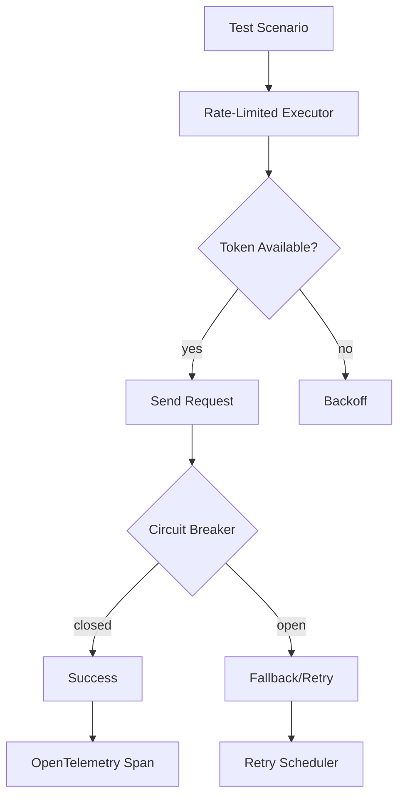

| Difficulty | Channel | Tags |
|---|---|---|
| advanced | api-testing | postman, rest-assured, supertest |

Uber’s growth from roughly 500 microservices in 2015 to over 2,000 by 2017 created visibility blind spots across service boundaries. To regain end-to-end visibility, Uber leaned into distributed tracing with Jaeger, tracing requests across hundreds of services and enabling faster root-cause analysis 1. That leap in observability inspired a journey: how can a REST API testing framework simulate real-world load at scale while keeping tests reliable and actionable?

---

## Hooking the Reader Into Scale

Picture this: a testing suite under pressure, throwing thousands of concurrent requests at a microservices mesh, yet returning deterministic results. The stakes aren’t just latency numbers; they’re confidence, recovery time, and the ability to pinpoint failures without pulling the entire system offline. In this world, end-to-end tracing isn’t a luxury—it’s a navigation tool that guides the test engineer through the maze of inter-service chatter 1 .

## Discovery at Scale

Many developers discover that conventional load tests collapse when rate limits, partial failures, and distributed traces cross service boundaries. The breakthrough is treating test orchestration like a production traffic manager: orchestrate concurrency, enforce safety nets, and propagate context across services so a test failure mirrors a real incident. The core idea is to design for concurrency with observability baked in from the start, rather than as an afterthought.

## The Architecture That Holds

Harmonics of a scalable test framework emerge when four patterns align: rate limiting, circuit breaking, distributed tracing, and efficient request batching. The following building blocks form a resilient baseline: Rate limiting: token bucket logic guarded by a distributed counter (e.g., Redis) to prevent test bursts from overwhelming real services 2 . Circuit breaking: Hystrix-style thresholds with exponential backoff to fail fast and recover gracefully when a downstream service degrades 4 . Distributed tracing: propagate trace context across test and target services so end-to-end paths are visible and root causes are identifiable 1 3 . Request batching: async HTTP client pools with connection multiplexing to maximize throughput while preserving test determinism 5 .

## The Twist: Observability As a Test Feature

The counterintuitive insight is that instrumentation should be lightweight and purposeful. Rather than instrumenting every microservice in depth for every test, leverage backend-driven sampling and sidecar approaches to minimize overhead while still capturing representative traces. This keeps test latency predictable and the observability stack scalable enough to mirror production traffic patterns. Debates often arise around the cost of tracing—the answer lies in intelligent sampling and selective instrumentation that preserves signal with minimal noise 1 3 .

## Real-World Proof: Lessons From the Field

Netflix popularized the circuit-breaker pattern with Hystrix, illustrating how fail-fast and backoff can preserve system stability under stress 4 . Uber’s tracing journey demonstrates how a purpose-built backend and language-agnostic instrumentation can scale tracing across hundreds of services, enabling end-to-end visibility and rapid root-cause analysis as service counts explode 1 . These stories underscore the payoff: tuning latency, throughput, and reliability while maintaining a coherent view across the entire service graph.

## Putting It Into Practice

Implement the core components in a cohesive framework: Rate limiting: implement a token bucket with a distributed counter (Redis) to cap test load and emulate real-world quotas 2 . Circuit breaking: adopt a Hystrix-like state machine with exponential backoff to isolate downstream failures and allow the system to breathe 4 . Distributed tracing: propagate OpenTelemetry context across the test suite and backend services to achieve end-to-end visibility 5 6 . Batching: use async HTTP client pools and multiplexed connections to maximize concurrency without overwhelming the target systems 3 . Real-World Case Study Uber Uber grew from ~500 microservices in 2015 to over 2,000 by early 2017, creating visibility challenges across service boundaries. They adopted Jaeger for distributed tracing to trace requests across hundreds of services, recording thousands of traces per second, enabling end-to-end visibility and faster root-cause analysis. Key Takeaway: End-to-end tracing at scale requires a purpose-built backend, language-agnostic instrumentation, and an architecture that minimizes instrumentation overhead (e.g., sidecar agents and backend-driven sampling strategies).

## Wrapping Up

The takeaway is clear: design test frameworks as scalable, observable systems from day one. Instrumentation, safe load management, and a resilient architecture together unlock confidence that production-like traffic can be tested without compromising stability.

> **Did you know?**
> The term 'Hystrix' stems from a fierce defensive animal—an apt metaphor for a fallback barrier that bites back at cascading failures.

---

## Architecture & Flow

<strong>Original Interview Question</strong>

**Q:** How would you design a REST API testing framework that handles rate limiting, circuit breaking, and distributed tracing for microservices with 10,000+ concurrent requests?

**A:** Implement an asynchronous request batching system with token bucket rate limiting, Hystrix circuit breaker patterns, and OpenTelemetry distributed tracing across test suites.

## Conclusion

The takeaway is clear: design test frameworks as scalable, observable systems from day one. Instrumentation, safe load management, and a resilient architecture together unlock confidence that production-like traffic can be tested without compromising stability.

---

## References

1. [Jaeger](https://github.com/jaegertracing/jaeger) — documentation
2. [Token Bucket](https://en.wikipedia.org/wiki/Token_bucket) — documentation
3. [Hystrix](https://github.com/Netflix/Hystrix) — documentation
4. [OpenTelemetry](https://github.com/open-telemetry/opentelemetry-js) — documentation
5. [HTTP/1.1 (RFC 7231)](https://datatracker.ietf.org/doc/html/rfc7231) — documentation
6. [REST Assured](https://github.com/rest-assured/rest-assured) — documentation
7. [AWS X-Ray Developer Guide](https://docs.aws.amazon.com/xray/latest/devguide/xray.html) — documentation
8. [OpenTelemetry – Collector](https://github.com/open-telemetry/opentelemetry-collector) — documentation
9. [Python asyncio](https://docs.python.org/3/library/asyncio.html) — documentation
10. [Hypertext Transfer Protocol (Wikipedia)](https://en.wikipedia.org/wiki/Hypertext_Transfer_Protocol) — documentation
11. [Postman GitHub](https://github.com/postmanlabs/postman-app-support) — documentation

---

**Author:** Satishkumar Dhule — [GitHub](https://github.com/satishkumar-dhule) · [LinkedIn](https://linkedin.com/in/satishkumar-dhule) · [Website](https://satishkumar-dhule.github.io)
