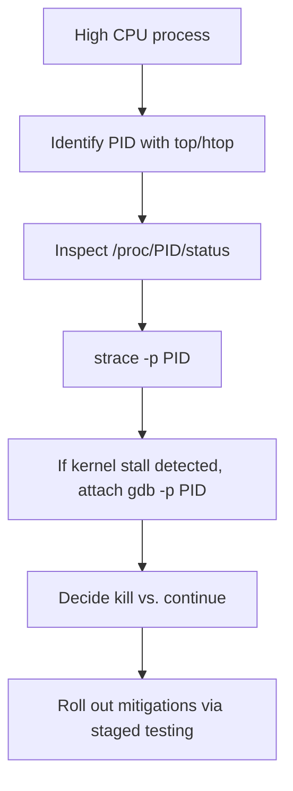

| Difficulty | Channel | Tags |
|---|---|---|
| intermediate | operating-systems | operating-systems |

Picture this: ClickHouse Cloud on GCP encounters random, unresponsive pods where CPU spikes to 100% and signals go unheard. It isn’t a single buggy line of code; it’s production hell where typical tracing fails 1. This isn’t just a bug hunt; it’s a crash course in reading the orchestra of a cloud kernel and learning when memory reclaim can masquerade as a user-space problem 1.

---

## Hook and Stakes

In the real world, a data analytics service suddenly loses responsiveness across multiple pods. The team leans on familiar tools, but the signals don’t cooperate. The pressure isn’t only latency—it’s gotta keep dashboards live and customers honest. This story starts with a 3am paging event and ends with a kernel-level windfall of insights that change how production is approached forever. The ClickHouse incident becomes the blueprint: when CPU is pegged and standard tracing stalls, the root cause can hide in kernel memory reclaim behavior, especially in cloud kernels 1 .

## The Hunt: From Signals to Silence

You start with the basics—identify the offender with top or htop to pick out the PID quietly siphoning cycles 2 . Then peek into /proc/PID/status to confirm the process state and activity. If the stack stays murky, attach strace -p PID to watch system calls in real time and spot surprising stalls 3 . When user-space traces reach a dead end, a deeper look into the kernel story is required; attaching a debugger like gdb -p PID can reveal where the thread is blocked, especially if it’s stuck waiting on kernel resources 5 . The journey often reveals a tension between what the app does and what the kernel memory manager is doing behind the curtain 1 .

## The Twist: Kernel Memory Reclaim in the Spotlight

The twist is counterintuitive: production delays may resemble a stubborn user-space bug, but the culprit is memory reclaim throttling or livelocks within the kernel. Modern cloud kernels can exhibit intermittent reclaim behavior, particularly under memory pressure or unusual memory reclaim policies like MGLRU, which can mask as unresponsive CPU behavior 1 . To uncover this, engineers turn to kernel-space tracing and sampling tools— perf and flame-graph style visualizations help map long-latency stalls back to memory reclamation paths 6 7 . When signals and standard tracing fail, kernel tracing becomes essential, and reproducible stress tests validate hypotheses before changing rollout plans 1 .

## Resolution: From Diagnosis to Guardrails

Resolution hinges on disciplined instrumentation and controlled restarts. If a process remains unresponsive to SIGKILL , the immediate action is to terminate with care, then inspect logs for patterns that hint at resource contention, memory pressure, or I/O blocking. The ClickHouse team confirmed that kernel memory reclaim issues required rigorous testing and staged rollouts before stabilizing production; journalism aside, the practical takeaway is to craft reproducible workloads that stress memory reclaim in staging before a cloud rollout 1 . Real-World Case Study ClickHouse ClickHouse Cloud on GCP experienced random, unresponsive pods where CPU usage spiked to 100% and could not be profiled with standard tools, forcing manual restarts; investigation revealed intermittent, cloud-specific kernel behavior affecting memory reclaim. Key Takeaway: Kernel memory reclaim can cause production delays that resemble user-space issues; when signals and traditional tracing fail, kernel tracing (bpftrace, perf) and reproducible stress tests are essential; modern kernel features like MGLRU can mitigate stubborn livelocks, but cloud-provider kernel differences require careful rollout and testing.

## Wrapping Up

The moral: production reliability hinges on looking both above and below the user-space surface. Instrumentation, reproducible tests, and staged deployments make the difference between a one-off fix and a durable solution. Talk less, trace more, and test in prod-like environments.

> **Did you know?**
> MGLRU, a modern memory reclaim strategy, aims to reduce livelocks in cloud kernels, but it requires careful rollout and testing across provider variants

---

## Architecture & Flow

<strong>Original Interview Question</strong>

**Q:** How would you debug a process that's consuming 100% CPU but not responding to signals? What tools and steps would you use?

**A:** Start by identifying the process ID using `top` or `htop` to confirm the high CPU usage. Then attach `strace -p ` to monitor system calls and determine if the process is stuck in user space or kernel mode. Check `/proc//status` for the process state and examine `/proc//stack` for kernel stack information. If the process remains unresponsive, use `gdb -p ` to obtain stack traces and analyze the execution context.

## Conclusion

The moral: production reliability hinges on looking both above and below the user-space surface. Instrumentation, reproducible tests, and staged deployments make the difference between a one-off fix and a durable solution. Talk less, trace more, and test in prod-like environments.

---

## References

1. [The case of the vanishing CPU: A Linux kernel debugging story](https://clickhouse.com/blog/a-case-of-the-vanishing-cpu-a-linux-kernel-debugging-story) — article
2. [Linux kernel](https://en.wikipedia.org/wiki/Linux_kernel) — article
3. [Strace](https://github.com/strace/strace) — repository
4. [Virtual memory](https://en.wikipedia.org/wiki/Virtual_memory) — article
5. [Linux kernel source](https://github.com/torvalds/linux) — repository
6. [Perf tools](https://github.com/brendangregg/perf-tools) — repository
7. [FlameGraph](https://github.com/brendangregg/FlameGraph) — repository
8. [Process (computing)](https://en.wikipedia.org/wiki/Process_(computing)) — article
9. [bpftrace](https://github.com/iovisor/bpftrace) — repository
10. [Linux performance analysis with Brendan Gregg](https://github.com/brendangregg/perf-tools) — repository

---

**Author:** Satishkumar Dhule — [GitHub](https://github.com/satishkumar-dhule) · [LinkedIn](https://linkedin.com/in/satishkumar-dhule) · [Website](https://satishkumar-dhule.github.io)
