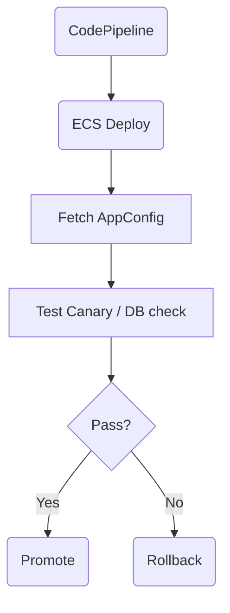

| Difficulty | Channel | Tags |
|---|---|---|
| beginner | aws-devops-pro | aws-devops-pro |

Picture this: a multi-tenant SaaS platform planning a new response format. CyberArk tackled this with AWS AppConfig-driven feature flags, enabling canary-style releases and fast rollback without redeploys 1. The reader follows a journey where centralized config becomes the difference between a bold rollout and a brittle rollback, keeping customers happy and engineers unshackled.

---

## Building on CyberArk’s Insight

Many developers discover that toggling behavior at runtime beats pushing new code just to test. CyberArk’s pattern shows how feature flags, powered by AWS AppConfig, decouple deployment from release. This approach lets teams expose a new response format behind a boolean flag (newFormat) and control rollout fractionally via configuration changes, not code changes 1 . This is not a theory exercise—it's a practical strategy that scales with CI/CD, canaries, and quick rollback when needed. Hearing about this in practice makes the value immediately tangible: you can flip a switch in AppConfig, observe the impact, and revert in seconds if something goes off the rails. The core idea: centralize the flag, automate its propagation, and keep runtime logic ready to honor the toggle without touching code paths at every release. 2 11

## The Minimal IaC Footprint

This journey starts with a lean Infrastructure as Code footprint. The goal is to create just enough AppConfig resources to host the flag and integrate with the existing pipeline. In CDK or CloudFormation terms, this means an Application, an Environment, a ConfigurationProfile, and a HostedConfigurationVersion. The flag itself sits in a hosted configuration (a JSON or YAML payload with a boolean newFormat). A small snippet illustrates the idea (pseudo-CDK): // Pseudo-CDK to create AppConfig resources new appconfig.CfnApplication(this, 'App'); // Environment, ConfigurationProfile, HostedConfigurationVersion would follow This keeps the surface area minimal while enabling centralized control that CI/CD can drive. For orchestration, tie AppConfig changes into CodePipeline so that a config update can accompany or precede a feature rollout, with the ability to rollback via AppConfig prior versions. 2 11

## Startup Fetch and Cache: a Simple Runtime Pattern

The API should fetch the AppConfig flag at startup and cache the value for a short window (for example, a few minutes) to balance latency with freshness. The runtime path reads newFormat on startup and uses a safe default if the fetch fails. The cache reduces repeated calls and avoids startup delays during high-traffic bursts. If the evaluation of the flag encounters an error, the system can gracefully fall back to the previous behavior, preserving user experience while signaling for a quick review. This pattern aligns with AppConfig’s role as a centralized, versioned source of truth for feature toggles. 2 11

## The Twist: Rollback Criteria and Drift Mitigation

What happens when AppConfig fetch or evaluation fails? The prudent approach is to define rollback criteria that are evaluated at startup and during health checks. If fetch fails, or if the flag evaluation yields an inconsistent result, revert to the last known-good configuration and emit a clear alert for the team. This is where observability matters: monitor AppConfig fetch latency, error rates, and clock drift between configuration versions. The goal is to treat config as a first-class, versioned artifact that never blocks progress when things go wrong. 11 2

## Real-World Proof: CyberArk’s Use Case Refined

Real-world stories illuminate the path. CyberArk’s implementation demonstrates how feature flags via AppConfig support safe, gradual releases tied to CI/CD and serverless or container runtimes. The approach enables canary-style rollouts, quick rollback, and centralized change management, all without code redeploys. This pattern mirrors broader industry lessons: versioned configurations with automatic rollback reduce blast radii and accelerate learning in production. 1 2

## Transformation: What This Means for Teams

Building a flag-driven rollout changes the culture: teams move from push-to-prod to verify-and-rollout. The minimal IaC, startup fetch, and rollback criteria provide a repeatable blueprint for safe experimentation. In practice, this means smaller blast radii, faster feedback, and a simple rollback story when the new format proves too disruptive. The transformation is less about new code and more about disciplined configuration and observability. 2 11 Real-World Case Study CyberArk CyberArk uses AWS AppConfig to implement feature flags for its SaaS services, enabling dynamic configuration and canary-style releases without code redeploys, tied into its CI/CD processes and Lambda-based runtime evaluation. Key Takeaway: Feature flags managed via AppConfig decouple deployment from release, enable safe gradual rollouts and quick rollback, and can be integrated with serverless runtimes or containers; maintain strict versioning and monitoring to detect and rollback issues promptly.

## Wrapping Up

The story closes with a practical lesson: centralize feature control, automate safe rollouts, and design for quick rollback. Tomorrow’s deployments should feel confident, not risky, because a well-placed flag can save the day.

> **Did you know?**
> Many developers discover feature flags reduce Mean Time to Recovery (MTTR) during releases by keeping behavior toggles out of code paths.

---

## Architecture & Flow

<strong>Original Interview Question</strong>

**Q:** In a single-region ECS Fargate deployment behind an ALB, with CodePipeline pulling from GitHub, introduce a feature flag using AWS AppConfig to enable a new response format. Describe the minimal IaC changes, how the API would fetch/cache the flag at startup, and the rollback criteria if AppConfig fetch or evaluation fails?

**A:** Implement a feature flag with AWS AppConfig in the existing pipeline. Create a hosted configuration profile with a boolean newFormat flag. Have the API fetch the flag on startup (with a short cache) a

## Conclusion

The story closes with a practical lesson: centralize feature control, automate safe rollouts, and design for quick rollback. Tomorrow’s deployments should feel confident, not risky, because a well-placed flag can save the day.

---

## References

1. [How CyberArk Implements Feature Flags with AWS AppConfig](https://aws.amazon.com/blogs/mt/how-cyberark-implements-feature-flags-with-aws-appconfig/) — article
2. [What is AWS AppConfig](https://docs.aws.amazon.com/appconfig/latest/userguide/what-is-appconfig.html) — documentation
3. [AWS CloudFormation – AWS::AppConfig::Application](https://docs.aws.amazon.com/AWSCloudFormation/latest/UserGuide/aws-resource-appconfig-application.html) — documentation
4. [CodePipeline User Guide](https://docs.aws.amazon.com/codepipeline/latest/userguide/welcome.html) — documentation
5. [Amazon ECS with Fargate](https://docs.aws.amazon.com/ecs/latest/userguide/fargate.html) — documentation
6. [Application Load Balancers – Introduction](https://docs.aws.amazon.com/elasticloadbalancing/latest/application/introduction.html) — documentation
7. [AWS CDK Guide](https://docs.aws.amazon.com/cdk/v2/guide/home.html) — documentation
8. [What is a Canary Release?](https://www.digitalocean.com/community/tutorials/what-is-a-canary-release) — documentation
9. [Feature toggle](https://en.wikipedia.org/wiki/Feature_toggle) — documentation
10. [GitHub Actions](https://docs.github.com/en/actions) — documentation
11. [AppConfig Monitoring and Telemetry](https://docs.aws.amazon.com/appconfig/latest/userguide/monitoring-appconfig.html) — documentation
12. [AWS Lambda](https://docs.aws.amazon.com/lambda/index.html) — documentation
13. [Kubernetes ConfigMaps and configuration](https://kubernetes.io/docs/concepts/configuration/overview/) — documentation
14. [Chaos Monkey](https://en.wikipedia.org/wiki/Chaos_Monkey) — documentation

---

**Author:** Satishkumar Dhule — [GitHub](https://github.com/satishkumar-dhule) · [LinkedIn](https://linkedin.com/in/satishkumar-dhule) · [Website](https://satishkumar-dhule.github.io)
