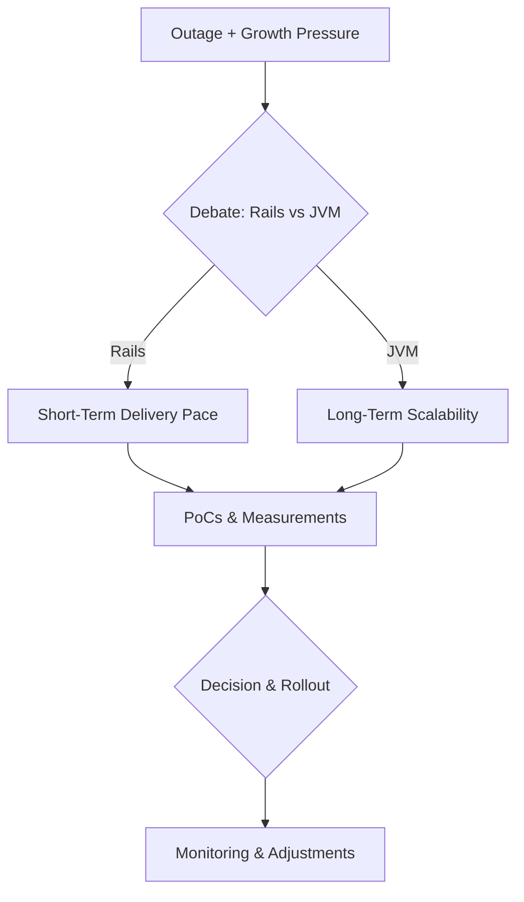

| Difficulty | Channel | Tags |
|---|---|---|
| beginner | behavioral | negotiation, mediation, feedback |

It was a crisis moment for a social giant: outages piled onto mounting growth, and the engineering team faced a fork in the road between their trusted Rails stack and a JVM-based alternative. Twitter jilted Ruby for Scala 1, a pivot born from pressure, not pride. This isn’t a textbook tale—it's a practical blueprint for turning disagreement into a disciplined, data-driven decision that preserves relationships and accelerates delivery. In this story, the problem isn’t winning the argument; it’s steering the ship when the sea is rough.

---

## The Fork in the Stack

Picture two senior engineers debating the path forward: one advocates continuing with Ruby on Rails to ship fast, the other champions a JVM-based stack (Java/Scala) to scale with growth. The stakes aren’t theoretical—a major outage and relentless traffic growth put real pressure on maintainability, deployment velocity, and total cost of ownership. The clash isn’t about personalities; it’s about choosing a direction that scales without eroding team cohesion. Twitter’s real-world pivot in 2009 illustrates how a high-stakes disagreement can catalyze a rigorous, shared understanding of long-term costs and maintenance needs 1 .

## Listening Before Proposing

The first move is to turn disagreement into dialogue. A 1:1 conversation helps uncover hidden concerns—whether maintenance toil, tool maturity, or the learning curve for new team members. You’ll find that what seems like a preference is often a concern about risk, not a veto on technology. The goal is to surface these worries early, acknowledge them, and map them to measurable outcomes. This approach aligns with the broader principle that effective architecture starts with listening, not marching an opinion forward 2 .

## Proof of Concept as the Neutral Ground

Rather than debating abstractions, teams run targeted PoCs to compare options in the wild. A small, bounded experiment can reveal maintenance burdens, tooling gaps, and performance envelopes that spreadsheets never capture. PoCs become the neutral ground where hypotheses turn into data. When teams ground decisions in concrete findings, the debate shifts from ‘which is cooler’ to ‘which is sustainable at scale’ 3 .

## Finding the Win-Win

Compromise emerges as the real power move: designs that address multiple concerns—maintenance, speed of delivery, and operator toil—without forcing a single camp. The payoff is not merely a chosen stack; it’s a plan that preserves relationships, fosters psychological safety, and keeps delivery on track. This is the heart of a high-performing team: decisions that are robust, not brittle, and collaborative, not command-and-control. In practice, this means documenting trade-offs, aligning on success metrics, and leaving room for revisiting the choice as the product evolves 4 .

## Real-World Proof

A well-known industry pivot demonstrates how a calm, data-driven approach can resolve a polemic into a pragmatic path forward. Twitter’s move away from Ruby toward Scala was not merely a stack switch; it was a disciplined process of listening, testing, and compromising to keep architecture aligned with scale while preserving team cohesion 1 . This pattern—listen, test, compromise—appears in many mature teams facing growth and outage pressures, reinforcing that the strongest outcomes come from human-centric decision-making alongside technical rigor 5 6 . Real-World Case Study Twitter Two senior engineers debated the stack: one argued for continuing with Ruby on Rails, while the other pushed for a JVM-based stack (Java/Scala) to handle growth. After a major outage and mounting scalability pressures, they engaged in targeted discussions and tests to understand maintenance and long-term costs before deciding on a path forward. Key Takeaway: Active listening, data-driven evaluation via PoCs, and a willingness to compromise across perspectives can align architecture with scale while preserving team relationships.

## Wrapping Up

Disagreements become catalysts when teams anchor decisions in listening, data, and compromise. Tomorrow’s engineering teams can deploy faster, scale smarter, and stay cohesive by treating debate as a collaboration problem, not a dominance contest.

> **Did you know?**
> Many developers discover that the hardest part of a stack switch is not the syntax, but aligning teams around shared goals and measurable criteria.

---

## Architecture & Flow

<strong>Original Interview Question</strong>

**Q:** Tell me about a time you had a disagreement with a teammate about how to approach a project. How did you handle it?

**A:** I had a disagreement with a teammate about the technical approach for a new feature. I advocated for using a modern framework while they preferred sticking with our existing technology stack. I scheduled a one-on-one meeting to understand their concerns about maintenance overhead and the learning curve for team members. After listening to their perspective, I proposed we build a small proof-of-concept using both approaches to evaluate them objectively. The prototype showed that while the new framework had some advantages, the existing stack was more suitable for this particular project given our timeline and team expertise. We ended up using the familiar technology but documented the new framework's benefits for future consideration. This experience strengthened our working relationship and established a more collaborative decision-making process.

## Conclusion

Disagreements become catalysts when teams anchor decisions in listening, data, and compromise. Tomorrow’s engineering teams can deploy faster, scale smarter, and stay cohesive by treating debate as a collaboration problem, not a dominance contest.

---

## References

1. [Twitter jilts Ruby for Scala](https://www.theregister.com/2009/04/01/twitter_on_scala/) — article
2. [Ruby on Rails](https://en.wikipedia.org/wiki/Ruby_on_Rails) — documentation
3. [Scala (programming language)](https://en.wikipedia.org/wiki/Scala_(programming_language)) — documentation
4. [Twitter](https://en.wikipedia.org/wiki/Twitter) — documentation
5. [Java (programming language)](https://en.wikipedia.org/wiki/Java_(programming_language)) — documentation
6. [Java Virtual Machine](https://en.wikipedia.org/wiki/Java_virtual_machine) — documentation
7. [Proof of Concept](https://en.wikipedia.org/wiki/Proof_of_concept) — documentation
8. [A/B testing](https://en.wikipedia.org/wiki/A/B_testing) — documentation
9. [Software architecture](https://en.wikipedia.org/wiki/Software_architecture) — documentation
10. [GitHub - scala/scala](https://github.com/scala/scala) — documentation
11. [AWS Auto Scaling](https://docs.aws.amazon.com/autoscaling/index.html) — documentation
12. [RFC 7231 - HTTP/1.1](https://datatracker.ietf.org/doc/html/rfc7231) — documentation
13. [arXiv: Attention Is All You Need](https://arxiv.org/abs/1706.03762) — paper

---

**Author:** Satishkumar Dhule — [GitHub](https://github.com/satishkumar-dhule) · [LinkedIn](https://linkedin.com/in/satishkumar-dhule) · [Website](https://satishkumar-dhule.github.io)
