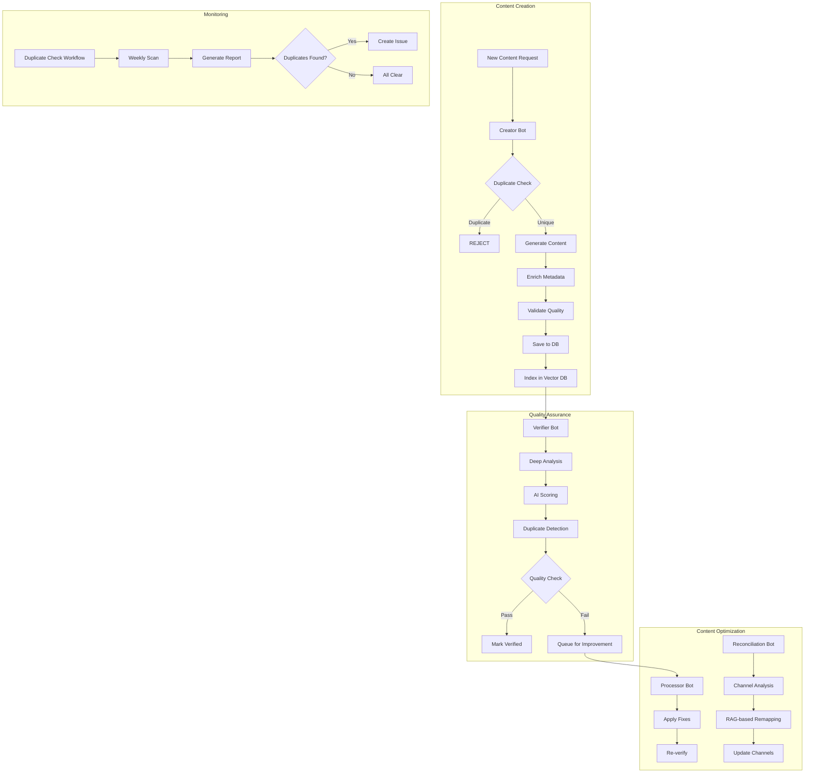

# 🎯 Content Quality System

Complete overview of the automated content quality and duplicate prevention system.

## System Architecture



## Components

### 1. Duplicate Prevention Service
**Purpose:** Prevent duplicate content creation using RAG

**Features:**
- Semantic similarity detection via vector embeddings
- Multi-threshold categorization (duplicate, very similar, similar, related)
- Automatic rejection of duplicates
- Fallback to text-based matching when vector DB unavailable
- Logging and monitoring

**Integration:**
- Creator Bot: Validates before creation
- Verifier Bot: Checks during verification
- Manual API: Available for direct use

**Files:**
- `script/ai/services/duplicate-prevention.js`
- `script/check-duplicates.js` (CLI tool)

### 2. Creator Bot
**Purpose:** Generate new content with quality checks

**Pipeline:**
1. **Classify** - Determine content type
2. **Generate** - Create content (with RAG enhancement)
3. **Enrich** - Add metadata, voice keywords, diagrams
4. **Validate** - Check duplicates and quality
5. **Save** - Persist to database and vector DB

**Duplicate Prevention:**
```javascript
// Automatic in validateNode()
const duplicateCheck = await checkDuplicateBeforeCreate(content, contentType);
if (duplicateCheck.isDuplicate) {
  return { error: 'Duplicate detected', skipSave: true };
}
```

**Files:**
- `script/bots/creator-bot.js`

### 3. Verifier Bot
**Purpose:** Comprehensive quality analysis

**Analysis Dimensions:**
- Technical Accuracy (25%)
- Clarity (15%)
- Completeness (20%)
- Practical Relevance (15%)
- Structure Quality (10%)
- Difficulty Calibration (10%)
- Voice Readiness (5%)

**Duplicate Detection:**
```javascript
// In duplicateCheckNode()
const similar = await findSimilarQuestions(item.id, item.question, item.channel);
if (similar.length > 0) {
  // Flag for review or deletion
}
```

**Files:**
- `script/bots/verifier-bot.js`

### 4. Reconciliation Bot
**Purpose:** Remap questions to correct channels using RAG

**Analysis:**
- RAG-based semantic similarity (60% weight)
- Keyword pattern matching (40% weight)
- Certification domain alignment

**Duplicate Prevention:**
- Identifies questions that are too similar within channels
- Suggests consolidation or differentiation

**Files:**
- `script/bots/reconciliation-bot.js`

### 5. Duplicate Check Workflow
**Purpose:** Automated weekly duplicate scanning

**Schedule:** Every Sunday at midnight UTC

**Actions:**
1. Scan all content for duplicates
2. Generate detailed report
3. Create GitHub issue if duplicates found
4. Optionally auto-fix (mark for deletion)
5. Run reconciliation after cleanup

**Files:**
- `.github/workflows/duplicate-check.yml`

## Usage Guide

### For Bot Development

**Always check for duplicates before creating:**

```javascript
import { checkDuplicateBeforeCreate } from './ai/services/duplicate-prevention.js';

async function createNewQuestion(questionData) {
  // 1. Check for duplicates
  const dupCheck = await checkDuplicateBeforeCreate(questionData, 'question');
  
  // 2. Handle result
  if (dupCheck.isDuplicate) {
    console.error('Duplicate found:', dupCheck.duplicates);
    throw new Error(dupCheck.message);
  }
  
  // 3. Warn about similar content
  if (dupCheck.similar.length > 0) {
    console.warn('Similar content exists:', dupCheck.similar);
  }
  
  // 4. Safe to create
  return await saveQuestion(questionData);
}
```

**Check before modifying:**

```javascript
import { checkDuplicateBeforeModify } from './ai/services/duplicate-prevention.js';

async function updateQuestion(questionId, updates) {
  // Check if modification would create duplicate
  const dupCheck = await checkDuplicateBeforeModify(
    questionId,
    { ...existingQuestion, ...updates },
    'question'
  );
  
  if (dupCheck.isDuplicate) {
    throw new Error('Modification would create duplicate');
  }
  
  return await saveQuestion(updates);
}
```

### For Manual Content Creation

**CLI Commands:**

```bash
# Check for duplicates
pnpm run check:duplicates

# Check specific channel
node script/check-duplicates.js --channel=aws

# Check coding challenges
node script/check-duplicates.js --type=challenge

# Generate detailed report
node script/check-duplicates.js --report

# Auto-fix duplicates
pnpm run check:duplicates:fix
```

### For CI/CD Integration

**Trigger duplicate check manually:**

1. Go to Actions tab
2. Select "🔍 Duplicate Detection"
3. Click "Run workflow"
4. Configure options:
   - Content type
   - Channel filter
   - Auto-fix option

**Automated weekly check:**
- Runs every Sunday
- Generates report
- Creates issue if duplicates found

## Quality Metrics

### Duplicate Detection Accuracy

| Method | Accuracy | Speed | Fallback |
|--------|----------|-------|----------|
| Vector DB (RAG) | 95%+ | 50-100ms | Yes |
| Text-based | 70-80% | 10-20ms | N/A |

### Content Quality Scores

| Score Range | Status | Action |
|-------------|--------|--------|
| 90-100 | Excellent | Verified |
| 75-89 | Good | Verified |
| 65-74 | Acceptable | Verified with notes |
| 50-64 | Needs Improvement | Queue for processor |
| <50 | Poor | Flag for deletion |

### Similarity Thresholds

| Similarity | Category | Action |
|------------|----------|--------|
| ≥90% | Duplicate | Reject |
| 80-89% | Very Similar | Manual review |
| 70-79% | Similar | Review recommended |
| 60-69% | Related | Create with caution |
| <60% | Unique | Safe to create |

## Monitoring Dashboard

### Key Metrics to Track

```sql
-- Duplicate detection rate
SELECT 
  content_type,
  COUNT(*) as total_checks,
  SUM(is_duplicate) as duplicates_found,
  ROUND(SUM(is_duplicate) * 100.0 / COUNT(*), 2) as duplicate_rate
FROM duplicate_checks
WHERE timestamp > datetime('now', '-30 days')
GROUP BY content_type;

-- Content quality distribution
SELECT 
  CASE 
    WHEN score >= 90 THEN 'Excellent'
    WHEN score >= 75 THEN 'Good'
    WHEN score >= 65 THEN 'Acceptable'
    WHEN score >= 50 THEN 'Needs Improvement'
    ELSE 'Poor'
  END as quality_tier,
  COUNT(*) as count
FROM bot_ledger
WHERE bot_name = 'verifier'
  AND action = 'verify'
  AND created_at > datetime('now', '-30 days')
GROUP BY quality_tier;

-- Bot activity summary
SELECT 
  bot_name,
  action,
  COUNT(*) as count,
  DATE(created_at) as date
FROM bot_ledger
WHERE created_at > datetime('now', '-7 days')
GROUP BY bot_name, action, DATE(created_at)
ORDER BY date DESC, bot_name;
```

## Best Practices

### 1. Always Check Before Creating
✅ **DO:** Run duplicate check before any content creation
❌ **DON'T:** Skip duplicate check to save time

### 2. Handle Recommendations Appropriately
✅ **DO:** Respect the recommendation (reject, review, create)
❌ **DON'T:** Override duplicate detection without review

### 3. Monitor Regularly
✅ **DO:** Review weekly duplicate reports
❌ **DON'T:** Ignore duplicate detection issues

### 4. Keep Vector DB Synced
✅ **DO:** Sync vector DB after bulk imports
❌ **DON'T:** Let vector DB get out of sync with database

### 5. Use Appropriate Thresholds
✅ **DO:** Adjust thresholds based on content type
❌ **DON'T:** Use same threshold for all content types

## Troubleshooting

### Issue: Too Many False Positives

**Symptoms:** Content flagged as duplicate when it's not

**Solutions:**
1. Increase similarity thresholds
2. Check vector DB sync status
3. Review flagged items manually
4. Adjust channel-specific patterns

### Issue: Duplicates Slipping Through

**Symptoms:** Duplicate content not detected

**Solutions:**
1. Lower similarity thresholds
2. Sync vector DB: `pnpm run vector:sync`
3. Run manual duplicate scan
4. Check vector DB connection

### Issue: Vector DB Connection Failed

**Symptoms:** "Vector DB search failed" errors

**Solutions:**
1. Check QDRANT_URL and QDRANT_API_KEY
2. System automatically falls back to text search
3. Sync vector DB when connection restored

### Issue: Slow Duplicate Checks

**Symptoms:** Checks taking >5 seconds

**Solutions:**
1. Reduce search limit
2. Add channel filters
3. Check vector DB performance
4. Consider caching results

## Performance Optimization

### Vector DB Optimization

```bash
# Rebuild vector DB index
pnpm run vector:sync -- --force

# Check collection stats
pnpm run vector:stats

# Optimize for specific channel
pnpm run vector:sync -- --channel=system-design
```

### Batch Processing

```javascript
// Instead of checking one by one
for (const item of items) {
  await checkDuplicateBeforeCreate(item, 'question');
}

// Use batch check
const results = await batchCheckDuplicates(items, 'question');
```

### Caching

```javascript
// Cache recent duplicate checks
const cache = new Map();

async function checkWithCache(content, contentType) {
  const key = `${contentType}:${content.question}`;
  
  if (cache.has(key)) {
    return cache.get(key);
  }
  
  const result = await checkDuplicateBeforeCreate(content, contentType);
  cache.set(key, result);
  
  return result;
}
```

## Future Enhancements

- [ ] Real-time duplicate detection API
- [ ] Duplicate resolution UI
- [ ] Cross-content-type duplicate detection
- [ ] Machine learning similarity model
- [ ] Automatic content merging
- [ ] Multi-language duplicate detection
- [ ] Fuzzy matching for typos
- [ ] Duplicate detection for images/diagrams

## Related Documentation

- [Duplicate Prevention](./DUPLICATE_PREVENTION.md)
- [Reconciliation Bot](./RECONCILIATION_BOT.md)
- [Creator Bot](./CREATOR_BOT.md)
- [Verifier Bot](./VERIFIER_BOT.md)
- [Vector DB Setup](./VECTOR_DB.md)
