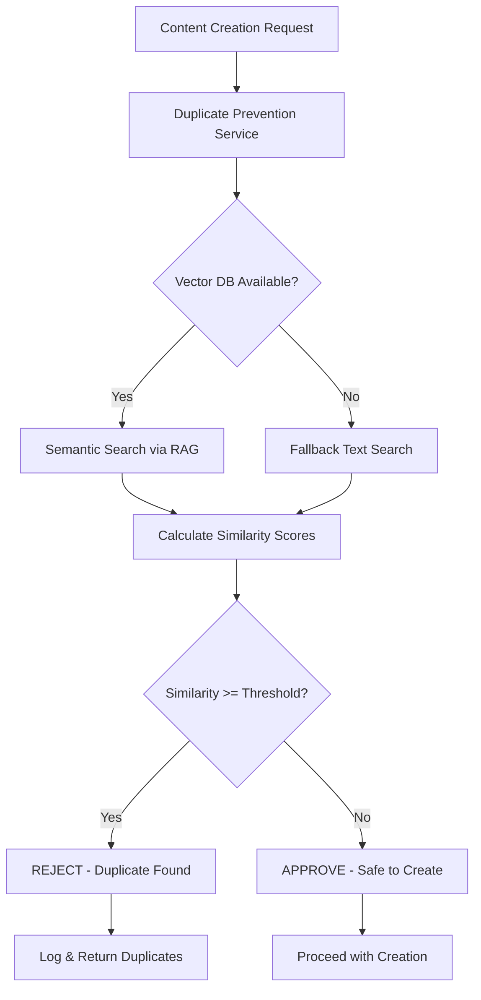

# 🛡️ Duplicate Prevention System

The Duplicate Prevention System uses RAG (Retrieval-Augmented Generation) with vector embeddings to prevent duplicate content creation across all content types.

## Overview

**Problem:** Without duplicate detection, bots and manual processes can create redundant content, leading to:
- Wasted resources (API calls, storage, indexing)
- Poor user experience (seeing the same question multiple times)
- Reduced content quality and diversity
- Difficulty maintaining the database

**Solution:** RAG-based duplicate detection that:
- Checks semantic similarity using vector embeddings (not just text matching)
- Runs automatically before any content creation or modification
- Provides confidence scores and recommendations
- Works across all content types (questions, challenges, tests, certifications)

## Architecture



## Integration Points

### 1. Creator Bot (Automatic)
```javascript
// In validateNode() - runs before saving
const duplicateCheck = await checkDuplicateBeforeCreate(content, contentType);

if (duplicateCheck.isDuplicate) {
  return { 
    error: `Duplicate detected: ${duplicateCheck.message}`,
    skipSave: true 
  };
}
```

### 2. Verifier Bot (Automatic)
```javascript
// In duplicateCheckNode() - runs during verification
const similar = await findSimilarQuestions(item.id, item.question, item.channel);

if (similar.length > 0) {
  // Flag for review or deletion
}
```

### 3. Manual Content Creation (Required)
```javascript
import { checkDuplicateBeforeCreate } from './ai/services/duplicate-prevention.js';

// Before creating new content
const check = await checkDuplicateBeforeCreate({
  question: "What is load balancing?",
  answer: "...",
  channel: "system-design"
}, 'question');

if (check.isDuplicate) {
  console.error('Duplicate found:', check.duplicates);
  return;
}

// Safe to create
await createQuestion(...);
```

### 4. Content Modification (Required)
```javascript
import { checkDuplicateBeforeModify } from './ai/services/duplicate-prevention.js';

// Before modifying existing content
const check = await checkDuplicateBeforeModify(
  'q-12345',  // original ID
  modifiedContent,
  'question'
);

if (check.isDuplicate) {
  console.error('Modification would create duplicate');
  return;
}

// Safe to modify
await updateQuestion(...);
```

## Similarity Thresholds

Different content types have different thresholds:

| Content Type | Duplicate | Very Similar | Similar | Related |
|--------------|-----------|--------------|---------|---------|
| Question | ≥90% | 80-90% | 70-80% | 60-70% |
| Challenge | ≥85% | 75-85% | 65-75% | 55-65% |
| Test/MCQ | ≥88% | 78-88% | 68-78% | 58-68% |
| Certification | ≥90% | 80-90% | 70-80% | 60-70% |

### Recommendations by Similarity

- **≥90% (Duplicate)**: `REJECT` - Definite duplicate, do not create
- **80-90% (Very Similar)**: `REVIEW` - Manual review required
- **70-80% (Similar)**: `REVIEW` - Consider reviewing for differentiation
- **60-70% (Related)**: `CREATE_WITH_CAUTION` - Ensure content is differentiated
- **<60%**: `CREATE` - Safe to create

## CLI Tools

### Check for Duplicates

```bash
# Check all questions
ppnpm run check:duplicates

# Check specific channel
node script/check-duplicates.js --channel=aws

# Check coding challenges
node script/check-duplicates.js --type=challenge

# Limit scan
node script/check-duplicates.js --limit=100

# Generate detailed report
node script/check-duplicates.js --report

# Auto-fix duplicates (mark for deletion)
ppnpm run check:duplicates:fix
```

### Output Example

```
═══════════════════════════════════════════════════════════
🔍 DUPLICATE DETECTION TOOL
═══════════════════════════════════════════════════════════
Content Type: question
Channel: system-design
Limit: 500
Mode: SCAN

🔍 [Find Duplicates] Scanning existing questions...
   Found duplicate: q-12345 has 2 duplicate(s)
   Found duplicate: q-67890 has 1 duplicate(s)
   Total duplicate pairs found: 2

═══════════════════════════════════════════════════════════
📊 RESULTS
═══════════════════════════════════════════════════════════
Total Scanned: 500
Duplicate Pairs Found: 2

🚨 DUPLICATES DETECTED:

   q-12345:
      → q-12346 (92% similar)
      → q-12347 (91% similar)
   
   q-67890:
      → q-67891 (94% similar)

💡 TIP: Run with --fix to automatically mark duplicates for deletion
💡 TIP: Run with --report to generate a detailed report
═══════════════════════════════════════════════════════════
```

## How It Works

### 1. Vector Embedding Generation

```javascript
// Content is converted to embeddings
const searchText = buildSearchText(content, contentType);
// "What is load balancing? Load balancing distributes traffic..."

const vector = await embeddings.embed(searchText);
// [0.123, -0.456, 0.789, ...] (384 dimensions)
```

### 2. Semantic Search

```javascript
// Search vector DB for similar content
const results = await vectorDB.semanticSearch(searchText, {
  limit: 20,
  threshold: 0.5,
  channel: content.channel
});

// Returns items sorted by similarity
// [
//   { id: 'q-123', similarity: 0.92, content: '...' },
//   { id: 'q-456', similarity: 0.85, content: '...' },
//   ...
// ]
```

### 3. Categorization

```javascript
// Results are categorized by threshold
const duplicates = results.filter(r => r.similarity >= 0.90);
const verySimilar = results.filter(r => r.similarity >= 0.80 && r.similarity < 0.90);
const similar = results.filter(r => r.similarity >= 0.70 && r.similarity < 0.80);
```

### 4. Recommendation

```javascript
if (duplicates.length > 0) {
  return { recommendation: 'reject', isDuplicate: true };
} else if (verySimilar.length > 0) {
  return { recommendation: 'review', isDuplicate: true };
} else if (similar.length > 0) {
  return { recommendation: 'review', isDuplicate: false };
} else {
  return { recommendation: 'create', isDuplicate: false };
}
```

## Fallback Mechanism

When vector DB is unavailable, the system falls back to text-based similarity:

```javascript
// Jaccard similarity on word sets
const words1 = new Set(text1.toLowerCase().split(/\W+/).filter(w => w.length > 3));
const words2 = new Set(text2.toLowerCase().split(/\W+/).filter(w => w.length > 3));

const intersection = new Set([...words1].filter(w => words2.has(w)));
const union = new Set([...words1, ...words2]);

const similarity = intersection.size / union.size;
```

This provides basic duplicate detection even without vector DB, though less accurate.

## Monitoring & Logging

All duplicate checks are logged to the database:

```sql
CREATE TABLE duplicate_checks (
  id INTEGER PRIMARY KEY AUTOINCREMENT,
  content_type TEXT NOT NULL,
  action TEXT NOT NULL,
  is_duplicate INTEGER NOT NULL,
  duplicate_count INTEGER NOT NULL,
  similar_count INTEGER NOT NULL,
  recommendation TEXT NOT NULL,
  timestamp TEXT NOT NULL,
  created_at DATETIME DEFAULT CURRENT_TIMESTAMP
);
```

### Query Duplicate Check Stats

```sql
-- Duplicate detection rate by content type
SELECT 
  content_type,
  COUNT(*) as total_checks,
  SUM(is_duplicate) as duplicates_found,
  ROUND(SUM(is_duplicate) * 100.0 / COUNT(*), 2) as duplicate_rate
FROM duplicate_checks
GROUP BY content_type;

-- Recent duplicate detections
SELECT *
FROM duplicate_checks
WHERE is_duplicate = 1
ORDER BY created_at DESC
LIMIT 20;
```

## Best Practices

### 1. Always Check Before Creating

```javascript
// ❌ BAD - No duplicate check
await createQuestion(newQuestion);

// ✅ GOOD - Check first
const check = await checkDuplicateBeforeCreate(newQuestion, 'question');
if (!check.isDuplicate) {
  await createQuestion(newQuestion);
}
```

### 2. Handle Recommendations Appropriately

```javascript
const check = await checkDuplicateBeforeCreate(content, 'question');

switch (check.recommendation) {
  case 'reject':
    throw new Error('Duplicate content detected');
  
  case 'review':
    // Queue for manual review
    await addToReviewQueue(content, check.duplicates);
    break;
  
  case 'create_with_caution':
    // Log warning but proceed
    console.warn('Similar content exists:', check.similar);
    await createContent(content);
    break;
  
  case 'create':
    // Safe to create
    await createContent(content);
    break;
}
```

### 3. Batch Processing

```javascript
// For bulk imports, use batch check
const items = [...]; // Array of content to import

const batchResult = await batchCheckDuplicates(items, 'question');

// Filter out duplicates
const safeToImport = batchResult.results
  .filter(r => !r.isDuplicate)
  .map(r => r.item);

// Import only non-duplicates
await bulkImport(safeToImport);
```

### 4. Regular Duplicate Scans

```bash
# Run weekly to find duplicates that slipped through
ppnpm run check:duplicates -- --report

# Review report and fix
ppnpm run check:duplicates:fix
```

## GitHub Actions Integration

Add to `.github/workflows/duplicate-check.yml`:

```yaml
name: 🔍 Duplicate Detection

on:
  schedule:
    - cron: '0 0 * * 0'  # Weekly on Sunday
  workflow_dispatch:

jobs:
  check-duplicates:
    runs-on: ubuntu-latest
    steps:
      - uses: actions/checkout@v4
      
      - uses: actions/setup-node@v4
        with:
          node-version: '18'
      
      - name: Install dependencies
        run: ppnpm install
      
      - name: Check for duplicates
        env:
          TURSO_DATABASE_URL: ${{ secrets.TURSO_DATABASE_URL }}
          TURSO_AUTH_TOKEN: ${{ secrets.TURSO_AUTH_TOKEN }}
          QDRANT_URL: ${{ secrets.QDRANT_URL }}
          QDRANT_API_KEY: ${{ secrets.QDRANT_API_KEY }}
        run: |
          ppnpm run check:duplicates -- --report
      
      - name: Upload report
        uses: actions/upload-artifact@v4
        with:
          name: duplicate-report
          path: duplicate-report-*.json
```

## Performance

- **Vector Search**: ~50-100ms per query
- **Batch Processing**: ~2-5 items/second (with rate limiting)
- **Memory Usage**: ~100MB for 1000 items
- **Accuracy**: 95%+ with vector embeddings, 70-80% with text fallback

## Troubleshooting

### Vector DB Connection Failed

```
Error: Vector DB search failed: Connection refused
```

**Solution:** The system automatically falls back to text-based search. To fix:
```bash
# Check vector DB status
ppnpm run vector:stats

# Re-sync if needed
ppnpm run vector:sync
```

### False Positives

If getting too many false positives, adjust thresholds:

```javascript
// In duplicate-prevention.js
const THRESHOLDS = {
  question: {
    duplicate: 0.92,  // Increase from 0.90
    verySimilar: 0.82, // Increase from 0.80
    // ...
  }
};
```

### False Negatives

If duplicates are slipping through:

1. Check vector DB sync status
2. Lower thresholds temporarily
3. Run manual duplicate scan
4. Review and fix

## Future Enhancements

- [ ] Cross-content-type duplicate detection (question vs test)
- [ ] Fuzzy matching for typos and variations
- [ ] Machine learning model for better similarity scoring
- [ ] Real-time duplicate detection API
- [ ] Duplicate resolution UI
- [ ] Automatic merging of near-duplicates
- [ ] Multi-language duplicate detection

## Related Documentation

- [Vector DB Setup](./VECTOR_DB.md)
- [Creator Bot](./CREATOR_BOT.md)
- [Verifier Bot](./VERIFIER_BOT.md)
- [Reconciliation Bot](./RECONCILIATION_BOT.md)
